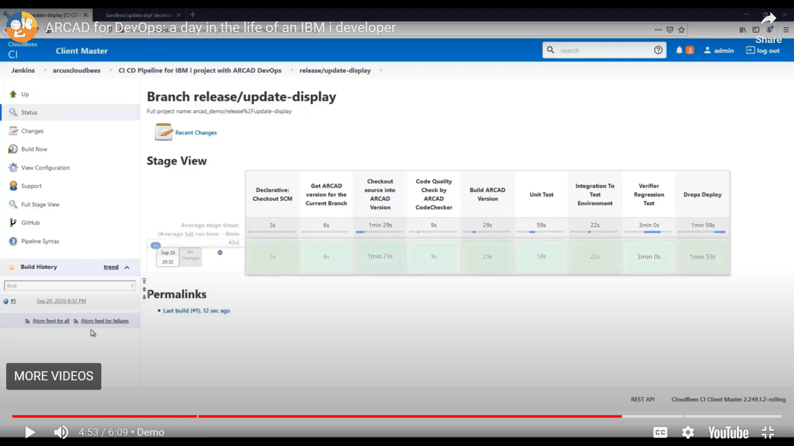
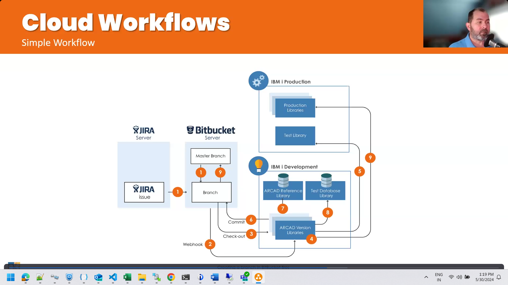

<h1 align=center> Analysis on Arcad for DevOps</h1>
 

(work in progress) 

Arcad for DevOps is a collection of various independent Arcad tools that are aimed towards IBMi.
       
><h3> Table of Contents 
</h3>

- [Observer](#observer)
- [Skipper](#skipper)
- [Builder](#builder)
- [Dashboard](#dashboard)
- [Project Management Plugins](#project-management-plugins)
- [+ DevOps Plugins](#-devops-plugins)
- [++ Code Checker](#-code-checker)
- [++ Unit Tester](#-unit-tester)
- [++ Verifier (regression testing automator)](#-verifier-regression-testing-automator)
- [Discover (new)](#discover-new)

## Observer
Arcad Observer is an Analysis tool (like iA) which is a desktop application that provides,
- X References on field level
- Flow charts
- Documentation of the architecture (not system!) (Refer MK Docs)
  
It comes with RDi pre installed, which is trapping the users in a Walled Garden

## Skipper
Arcad Skipper,
Checkout from Arcard is nothing but Pull from Git.
Web hooks from GitHub will create corresponding libraries onto the IBMi.
(Possibility of a middleman with reverse proxy)

Push is done from Arcad as (SCM Export)

Automation takes over after that.

Deployment is done in CI/CD tool.

## Builder
## Dashboard
## Project Management Plugins
## + DevOps Plugins
## ++ Code Checker
## ++ Unit Tester
## ++ Verifier (regression testing automator)
## Discover (new)

