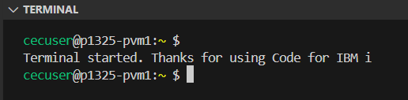
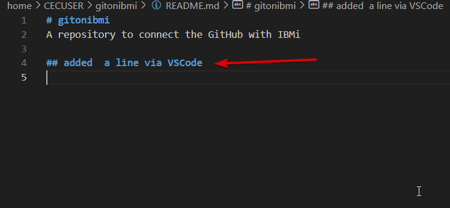
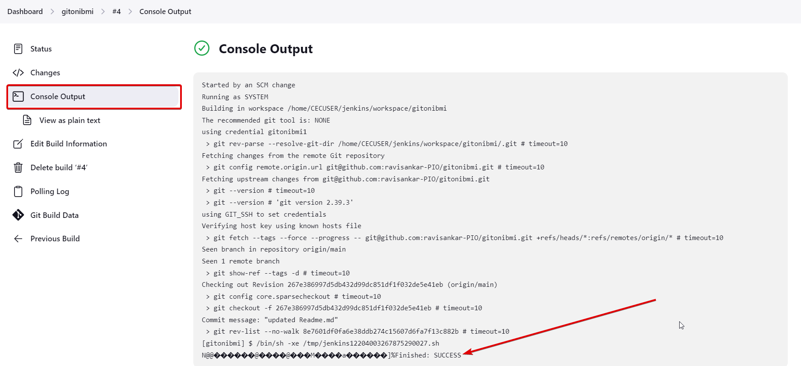

<h1 align=center> Modern DevOps Practices on IBMi</h1>
 
<p align = center> Practical Guide </p>
       
><h3> Table of Contents 
</h3>
  
- [Pre-requisites](#pre-requisites)
  - [Connect to IBMI from VS Code](#connect-to-ibmi-from-vs-code)
  - [Set Shell to BASH](#set-shell-to-bash)
  - [Set Open Source path/env variables](#set-open-source-pathenv-variables)
    - [Setup for PASE/SSH terminal](#setup-for-pasessh-terminal)
    - [Setup for IBMi Green screen (Optional)](#setup-for-ibmi-green-screen-optional)
  - [Verify the setup](#verify-the-setup)
  - [Update yum packages](#update-yum-packages)
- [Install GIT](#install-git)
- [Setup GITHUB](#setup-github)
- [Setup Jenkins](#setup-jenkins)
    - [Download the Jenkins install file.](#download-the-jenkins-install-file)
    - [Start Jenkins](#start-jenkins)
    - [Initial Configuration](#initial-configuration)
    - [Create a New Job in Jenkins](#create-a-new-job-in-jenkins)
    - [Configure the Job to connect to GitHub](#configure-the-job-to-connect-to-github)
- [Install GitBucket on IBMi](#install-gitbucket-on-ibmi)
- [Footnotes/References](#footnotesreferences)
- [Further Research](#further-research)
  - [GitLab](#gitlab)
  - [PM2](#pm2)
  - [Service-Commander](#service-commander)
  - [Gmake or BOB?](#gmake-or-bob)
  - [Chroot](#chroot)
  - [Test Cases](#test-cases)
  - [Migrate to IFS](#migrate-to-ifs)
  - [Todos](#todos)
- [Final Thoughts](#final-thoughts)
    - [For a Modernized IBM-i development:](#for-a-modernized-ibm-i-development)

---


# Pre-requisites
1. A GitHub Account
2. VS Code Editor
3. An IBM i server running 7.2 or above
4. Some patience and desire to learn something new.

## Connect to IBMI from VS Code
>*because, it is easy to execute shell commands and edit IFS files in VS Code!*
- Connect to IBMI via VS Code. You should knew that now already. If not, check [this](https://github.com/Programmersio-IBMi/vscode-integration/blob/main/README.md) link and come back here once you have connected your IBMi.  
- Enter `Ctrl + Shift + J` (once connected to the IBM I via VS Code) and select **PASE** terminal.


## Set Shell to BASH
>*because, the default shell is very limiting and irritating!*

Either set it via VS Code. 
  
  
  

  **<p align="center">OR</p>**
  
Enter the below command in the PASE terminal. *Don't forget to ==replace cecuser with your username==*
  ```bash
  /QOpenSys/pkgs/bin/chsh -s /QOpenSys/pkgs/bin/bash cecuser
  ```

## Set Open Source path/env variables
>*because, we need to tell the IBMI where to locate the open source linux commands.*

In order to be able to run the linux commands without specifying the location of the command, we have to setup the Open Source Path/Environment Variables. Do the below steps to do so.
### Setup for PASE/SSH terminal
Follow the below steps if you decide to run the applications from the PASE/SSH Terminal
- Navigate to your home folder by entering `cd ~`
- Enter command `touch .profile` in order to create a new file called *.profile*
- Open the file `.profile` using VS Code's IFS Browser
  
  
- Copy paste the below content on the `.profile` file.

```bash
export PATH=/QOpenSys/pkgs/bin:$PATH
export JAVA_HOME=/QOpenSys/QIBM/ProdData/JavaVM/jdk17/64bit
export JENKINS_HOME=/home/CECUSER/jenkins
export GITBUCKET_HOME=/home/CECUSER/gitbucket
source ~/git-prompt.sh
PROMPT_COMMAND='__posh_git_ps1 "\u@\h:\w " "\\\$ ";'$PROMPT_COMMAND
```
>**Explanation:**
>#1: The open source linux commands are available in the path `/QOpenSys/pkgs/bin`, so we are appending that location to the already available `$PATH` variable. 

>#2: The default JAVA version in IBMi sometimes would be 8. But Jenkins require version 11 or above. So we will tell IBMi to use the latest version of JAVA (17 in our case) for running Jenkins.

>#3: We are setting up the Jenkins' application on a folder called 'jenkins'. It provides better management of application, such as the whole application can be uprooted and planted in another location if required. 

>#4: Similarly, we are setting the Gitbucket's application on a folder called 'gitbucket'

### Setup for IBMi Green screen (Optional)
If you decide to start the application from the green screen, then you have to run these commands.
  ```js
  ADDENVVAR ENVVAR('JAVA_HOME') VALUE('/QOpenSys/QIBM/ProdData/JavaVM/jdk17/64bit') LEVEL(*SYS) REPLACE(*YES)
  ADDENVVAR ENVVAR('JENKINS_HOME') VALUE('/home/CECUSER/jenkins') LEVEL(*SYS) REPLACE(*YES)
  ADDENVVAR ENVVAR('GITBUCKET_HOME') VALUE('/home/CECUSER/gitbucket') LEVEL(*SYS) REPLACE(*YES)
  /* note: You need to have ALLOBJ or SECOFR authority to run these commands  */
  ```
  

  >Note: The one time setup of Environment Variables in green screen is optional. But it doesn't hurt to setup to prevent surprises when running the applications from green screen.

 ## Verify the setup
 Once the initial setup is complete,
- **Disconnect the IBMI from your VS Code and reconnect again**
- Once connected, open up the PASE terminal again by entering `Ctrl+Shift+J`. If the shell is set to bash successfully, you should see the below screen

- Run the below command to check whether the path variable has been setup correctly.
  ```bash
  echo -e '\n' $PATH '\n' $JAVA_HOME '\n' $JENKINS_HOME '\n' $GITBUCKET_HOME '\n'
  ```
  

## Update yum packages
In the PASE Terminal, enter the below commands,
```bash
yum update
yum upgrade
```
>**Note:** You want to run the update with caution as it might break the existing OSS applications. For that reason, it is best to use `chroot` to create separate container for this purpose. 

---


# Install GIT 
 
Enter the command below in your PASE terminal.
  -`yum install git`


>*GIT has been installed successfully*
---
 


# Setup GITHUB
Let's connect our IBMi with the GitHub and try pushing (a.k.a. updating our sources) directly to the GitHub Repository.

**Setup the user name and email for your local git**
  ```bash
  git config --global user.name 'Ravisankar Pandian' #To add a user name for the git application.

  git config --global user.email ravisankar.pandian@programmers.io #To add email for the git application 
  ```
**Generate a public/private keypair.**
 Enter the below command in your PASE terminal. (make sure to enter the email id that you use in your github account)
   `ssh-keygen -t ed25519 -C "ravisankar.pandian@programmers.io"`
- Hit enter again to save the key pair at the default location itself. 
- Hit enter again (no passphrase is required)
- Notice the location of the public key and open it in your VS Code. 
 

**Copy the public key**
- Navigate to the same folder in your VS Code as below and open the public key
  
  
- Copy all the contents of the file. We need to put that into our GitHub account.
  
**Create New SSH Key in your GitHub account**
- Open https://github.com/settings/keys and click 'New SSH Key'. 
- Enter some title, Select the key type as "authentication key", paste the previously copied public key, and finally select 'Add SSH Key"
  
- Once added, you should see the below screen
  

**Create a GitHub repository**
- Let's create a new empty repository in our GitHub account.
- Click on Repository >> Click New
  
- Enter the repository name, some meaningful description, set it public, add a README.md file and click create repository.
  
- Nice, we have our own GitHub repository now.
  
- Click on the green `<> Code` button, click on `SSH` and copy the URL
   
<br>
- FYI: This is the command that I just copied
`git@github.com:ravisankar-PIO/gitonibmi.git`

**Clone the GitHub Repository to your IBMi**
- Go to the PASE Terminal in VS Code and enter
  ```bash
  git clone git@github.com:ravisankar-PIO/gitonibmi.git
  ```
Enter `yes` if it asks for anything about Fingerprint and Keys. Now we have successfully cloned the GitHub Repository to our IBMi's IFS folder.

  

  

**Create a simple sqlrpgle program**
- Let's create an SQLRPGLE program which inserts a record into some file for every time it is called.
- Go to the PASE Terminal in VS Code and enter below command to *navigate to our repository folder*
  ```bash 
  cd gitonibmi
  ```
- *Now initialize the git repository*
  ```bash
  git init
  ```
-  => *And create a new SQLRPGLE program*
- Once created, open the same file in your VS Code editor via the IFS Browser.
  
<br>
- Copy paste the below code into the `buildr.sqlrpgle` file and save it.
```js
**free
dcl-s count int(10);
dcl-s note varchar(50);

exec sql SELECT COUNT(*) INTO :count FROM ravi.buildpf;
count += 1;
note = 'Build# ' + %char(count);
exec sql INSERT INTO ravi.buildpf (note) VALUES (:note);

*inlr = *on;
```

**Commit the program**
- Once you saved the sqlrpgle program, head over to the PASE Terminal and enter the below commands one by one. Read below for explanation
  ```bash
  git add buildr.sqlrpgle
  git commit -m "added build sqlrpgle program"
  git push
  ```
  >*Explanation*
  > * `git add` => we're telling the GIT that we're adding a new file in our repository. So that it will watch for that file for any changes.
  > * `git commit` => we're telling the GIT that we want to commit our changes for the previously added/edited files. The commit message describes the purpose of this change. Imagine you're doing a code change, so doing a  `git commit` means you're 100% sure that the code change is right and it can be pushed to the QA/Prod. Once the commit is done, git will take a snapshot of the entire repository and you can access this snapshot anytime (like a time machine). 
  > *  `git push` => we're telling the GIT to push the changes to the remote repository (GitHub). So far the changes are done only to the local git (i.e. dev library). Once this is done, the GitHub should reflect the updated sources. This is like promoting the sources to the QA/Prod.
  > * *Tip: between every command, you can check the status by issuing 'git status' command*

- Once the changes are pushed, you should see a message like something below
  

- Head over to the GitHub repository to check if the changes are updated there.
  

  **Congratulations! You have successfully modernized the IBM i development to GitHub.**

  


---


# Setup Jenkins
Jenkins is a java based application for setting up CI/CD pipeline. We will setup Jenkins in our IBMi and serve it from the IBMi's IP address itself.

### Download the Jenkins install file.
Run the below commands in your PASE terminal to download the `jenkins.war` via `wget` command.  
```bash
cd ~ 
wget http://mirrors.jenkins.io/war-stable/latest/jenkins.war
```

> *Jenkins is downloaded successfully!*
<br>

### Start Jenkins
Launching the Jenkins app is nothing but launching the `jenkins.war` file via a JAVA command with correct parameters. It can be started via multiple methods. 
*(Notice that I am using the **port# 9095**)*
* **Method-1:**  Use Process Management tool like Service Commander. **(preferred)**
  Jump to [this section](#service-commander) to view how to start the application via Service-Commander.
  
<br>

* **Method-2:** Start directly in an interactive SSH sesion
  Enter the below command in your PASE terminal.
  ```bash
  java -jar /home/CECUSER/jenkins.war --httpPort=9095
  ```
  *Note: You need to keep the PASE Terminal session alive for Method-2*

 ### Initial Configuration
- If all worked correctly, then a default admin password will be stored on the location `/jenkins/secrets/InitialAdminPassword` 
- Open the file `initialAdminPassword` and copy the contents of that file to your clipboard.
  


- **Jenkins initial setup in browser**
Head over to the browser and type in the IP address of the IBMi followed by the port# that we defined earlier. In my case, it is `http://129.40.94.17:9095/`. Paste the admin password that we just copied a while ago to unlock Jenkins. 


  Remember to select =="Install suggested plugins"==
  *(**Note**: It will take some time to load the next screen. Don't click more than once, as it might end up in error)*
  
  *plugins are currently loaded*
  

  Let's create an Admin user which will be used to login to the Jenkins app from now on. 

  ```
  UserName: ravi
  Password: welcome
  Email: ravisankar.pandian@programmers.io
  ```
  

  *click on save and finish to complete the setup*
  

  *Nice! we can start using the Jenkins now*
  

  *If you see a notification at the top as given below, It is advised to have a separate node for building the code. But we will click dismiss for now and continue with our work*
  

<br>

### Create a New Job in Jenkins
- On the Dashboard, click on New Item
  
  <br>
- Enter the Job Name as `gitonibmi`, select `freestyle project` and click OK.
  

### Configure the Job to connect to GitHub
- In the Job Configuration Page, Click on the `Source Code Management` on the left, and select `GIT`. 
- Remember the Repository URL that we copied a while ago from our GitHub? We need to paste that over here. 
  
- Make sure to clear out the branches to build field
  

**Add a credential**
- Notice the `+Add` button under credential. Click on it to add a credential to connect to the GitHub securely.
  *Note: Sometimes, the button will load slowly. So don't press multiple times*
  
- Enter the details as below
  - Domain - Global (unrestricted)
  - Kind - SSH Username with Private key
  - Scope - Global
  - ID - anything you like
  - Private key - Select `enter directly` => click add => Open the private key from your ssh folder as below => copy the entire content => finally paste it on Jenkins window.
   <br> 
  - Then click add
  - Then, click on the credentials drop down, and select the one that has your user name.
   

**Add a Build Trigger**
- Click on `Build Triggers` on the left menu and check `Poll SCM`
  
- Enter the value as `* * * * *` (5 asteriks with spaces inbetween). This is a cron scheduler which will look for any changes made in our repository for every minute and then execute the build steps.
  

**Add Build Steps**
- Scroll down to find `Build Steps` and click on it, then select `Execute Shell`
  
- Enter the below PASE command 
  `system "CALL PGM(RAVI/BUILDR)"`
  This means whenever the GitHub repository is committed (i.e. updated), we will call a program called `buildr` 
  <br>
- That's it! We will save the Job Configuration now.
  

**Error!**
Are you seeing this error below and wondering what you did wrong? Don't worry as I am on your side too! The same error happened to me as well. This could be a bug in Jenkins, but let's just proceed forward.
  

**What we have done so far?**
- We have added a Jenkins job to listen on the GitHub repository for any change.
- If any change(commit) occurs, then the Jenkins will execute the shell commands that we have entered in the 'build steps'. 
- The shell command is nothing but to call an SQLRPGLE program which will insert a record to the buildpf with the build#.

**Let's try it in action!**
- For the sake of simplicity, let's update the `README.md` file via VS Code and push the changes to the GitHub repo. We will expect the Jenkins to pickup the change and process the job.
- Open the `README.md` file
   
  <br>
- Add another line and save it.
   
  <br>
- Head over to the PASE terminal and enter commands below.
  ```bash
  git add *
  git commit -m "updated Readme.md"
  git push
  ```
  <br>
- Wait for a few seconds and check your build history in Jenkins. Click on the build#. In my case it is #4, but for you it should probably be #1.
   
  <br>

- Let's check the console ouput as well.
  
  It is success!
  <br>

- Let's check our physical file if the shell script got executed correctly.
  `select * from ravi/buildpf`
  
  >Nice! It is working

---


# Install GitBucket on IBMi
Gitbucket is a JAVA based SCM tool which can be run on IBMi. This is an Open Source alternative to GitHub.


**Download the GitBucket installation JAR file first**
Run the below commands in your PASE terminal
```bash
cd ~ 
wget https://github.com/gitbucket/gitbucket/releases/download/4.40.0/gitbucket.war
```

**Start GitBucket using the Java Command**
Launching the GitBucket app is nothing but opening the `gitbucket.war` file via a JAVA command with correct parameters. It can be started via multiple methods. 

*(Notice that I am using the **port# 8085**)*
* **Method-1: (preferred)** Start using Service Commander
  You should already 
  ```js
  SBMJOB CMD(QSH CMD('java -jar /home/CECUSER/gitbucket.war --port=8085')) JOB(GITBUCKET)
  ```
    <br>
* **Method-2:** Start directly in an interactive SSH sesion
  Head over to the green screen and issue the command below. 
  ```bash
  java -jar /home/CECUSER/gitbucket.war --port=8085
  ```
<br>

* **Method-3:** Use Process Management tool like PM2
  Jump to [this section](#pm2) to view how to start the application.

---
# Footnotes/References

- Jenkins 
  - [Getting started](https://devopscube.com/jenkins-2-tutorials-getting-started-guide/) with Jenkins.
  - Create Jenkins [pipeline](https://www.jenkins.io/doc/pipeline/tour/hello-world/)
  - [Setup Jenkins](https://github.com/worksofliam/blog/issues/43) on IBMi

- GitBucket 
  - A VCS that can be hosted within IBMi. Click [here](https://github.com/gitbucket/gitbucket/wiki) to learn more.
- Source Orbit ()
  - Defintion of [Source Orbit](https://ibm.github.io/sourceorbit/#/) - a dependency management system
  - A [blog post](https://github.com/worksofliam/blog/issues/66) by Liam Barry that tells about the SO - SourceOrbit.
- IBMi - CI
  - A built in CI tool within IBMi. See it in action [here](https://www.youtube.com/watch?v=t-9nOyBjjCU)
  - Learn more about [IBMi-CI](https://github.com/IBM/ibmi-ci)
- PM2
  - A [Node.JS package](https://pm2.keymetrics.io/docs/usage/quick-start/) used to manage the applications.
  -  Refer [this](https://github.com/worksofliam/blog/issues/4), [this](https://pm2.keymetrics.io/docs/usage/quick-start/) and [this](https://www.youtube.com/watch?v=0O2Nz5duuzg) link to automate Jenkins using PM2.
  
- Service Commander
  - A [command line tool](https://github.com/ThePrez/ServiceCommander-IBMi) for managing various services and applications running on IBMi. 

- Others
  - Click [here](https://ibmi-oss-docs.readthedocs.io/en/latest/yum/3RD_PARTY_REPOS.html) to view about the third party Repos for IBMI
  - [RPG-GIT-BOOK](https://github.com/worksofliam/rpg-git-book/blob/main/4-repository-host.md) - This is an excellent starting point for moving to GIT

- Ansible
  - Ansible for i's [github repo](https://github.com/IBM/ansible-for-i)
  - Ansible's [documentation for IBMi](https://ibm.github.io/ansible-for-i/index.html)
  - Ansible's [core documentation](https://docs.ansible.com/ansible/latest/network/getting_started/basic_concepts.html)
  - A [blog post](https://ibm.github.io/cloud-i-blog/archivers/2020_0602_automate_your_ibm_i_tasks_with_ansible) about Automating your IBM i tasks with Ansible.

---
# Further Research


## GitLab
Since Gitlab is an open source alternative for GitHub, I wanted to check if it can be installed on the IBMi. But it didn't helped.

First, I **Installed the dependencies for GitLab**
`yum install -y curl policycoreutils-python openssh-server perl`

https://packages.gitlab.com/install/repositories/gitlab/gitlab-ee/script.rpm.sh


- Read more about Gitlab
  - [dependencies for GitLab](https://archlinux.org/packages/extra/x86_64/gitlab/)
  - [CICD Script to connect GitLab with IBMI](https://gitlab.com/JDubbTX/IBMiExamples/-/blob/main/.gitlab-ci.yml?ref_type=heads)
  - [Gitlab installation methods](https://docs.gitlab.com/ee/install/install_methods.html)
  - [Gitlab installation steps](https://docs.gitlab.com/ee/install/installation.html)
  
---


## PM2
PM2 is a process management app (built on Node.js) which is like an enhanced Task Manager for IBMi. It will be used to autostart, keep the node.js & java based apps persistent.

**Install PM2**
- Kill the Jenkins app first if already launched by entering `Ctrl+c` two times on the PASE terminal where the Jenkins is currently launched.
- Install NodeJS =>  `yum install nodejs14`

- Then install PM2 =>  `npm install pm2@latest -g`

- Add the location of the nodejs's binary to the path
  - Open the .profile file and add a new location to include in path
  
  - Save and close the `.profile` file. Disconnect from IBMi and connect again (for the changes to take effect).

**Configure PM2**
- Create a new file called `jen.json` in your home folder. This will be used to start the Jenkins app.
  `touch jen.json`
- Paste this content into that file as below.
```json
  {
  "apps":[
  {
      "name":"jenkins",
      "cwd":".",
      "script":"/QOpenSys/usr/bin/java",
      "args":[
          "-jar",
          "jenkins.war",
          "--httpPort=9095"
      ],
      "exec_interpreter":"",
      "exec_mode":"fork"
   },
   {
    "name":"gitbucket",
    "cwd":".",
    "script":"/QOpenSys/usr/bin/java",
    "args":[
        "-jar",
        "/home/CECUSER/gitbucket/gitbucket.war",
        "--port=8085"
    ],
    "exec_interpreter":"",
    "exec_mode":"fork"
 }
 ]
}
```
- Run this command to start the Jenkins => `pm2 start jen.json`
- Once started, we can view the started apps by => `pm2 ls`
  
- For some reason, I am **unable to end the application via PM2**. So I searched for a better alternative and found the **IBMi native service commander**

---
## Service-Commander
- Install service commander using
  `yum install service-commander`
- Now we will do the one time setup to include the Jenkins app in our service commander utility.
- We already knew the command to start the jenkins app from the PASE Terminal which is 
  `java -jar /home/CECUSER/jenkins.war --httpPort=9095`
- We will just add `scinit` at the front to start the setup, that is
  `scinit java -jar /home/CECUSER/jenkins.war --httpPort=9095`
- Service commander is an intelligent tool that will ask us series of questions in order to be able to do the intial setup.

  | Question | Answer |  
  |-|-|
  | Would you like this service to be available to all users? [n] <br> <p style="font-size:8px;"> (we don't want other users to start this application)</p> | n
  | Short Name <br> <p style="font-size:8px;"> (this will be the name to start the application. So choose wisely)</p> | jenkins
  | Friendly Name <br> <small>(a short description about the app)</small> | Jenkins for IBMi
  | Start app in the current directory (/home/CECUSER)? [y] <br> <p style="font-size:8px;;"> (yes, we want to start the app in the current directory)</p> | y
  | Which ports does your app run on? <br> <p style="font-size:8px;"> (Enter the port# that the app is using) </p> | 9095
  | App to be run under a unique Job Name? <br> <p style="font-size:8px;"> (No, so we will leave it to blanks) </p> | <blanks>
  | Submit to batch? <br> <p style="font-size:8px;"> (No, we will run the app from within PASE environment)</p> | n
  | Environment Variables? <br> <p style="font-size:8px;"> (Since we have already setup the path variables, we will leave it as blanks)</p> | 
  | What Other Environment Variables? <br> <p style="font-size:8px;"> (Nothing here, just hit enter again)</p> | 
  | What Other groups would this app be a part of? <br> <p style="font-size:8px;"> (Nothing here, just hit enter again)</p> | 
  | What Other services would this app be a part of? <br> <p style="font-size:8px;"> (Nothing here, just hit enter again)</p> | 


- If all worked correctly, then you should see the below output
  

- Now let us start the application by entering
  `sc start jenkins`
  


---

## Gmake or BOB?
Gmake or BOB can be used to compile the objects directly from the IFS path, without the need to have source members as a middle man. 

*Following [this](https://ibm.github.io/ibmi-bob/#/getting-started/installation) article for BOB*

1. Install IBMi Repos =>   `yum install ibmi-repos`
2. Install BOB => `yum install bob`
faced an error

3. update yum packages => `yum update` and try again to install bob
4. Bob installed successfully
5. Let's test the build command by cloning a git repo.
   1. Create a library to save the build into
    `system "CRTLIB LIB(BOBTEST) TEXT('Better Object Builder test project')"`
    2. Clone the git repo (that already contains sample sources)
   `git clone https://github.com/ibm/bob-recursive-example`
   3. Change directory
  `cd bob-recursive-example`
   4. Set the environment variable to point the library that we just created
  `export lib1=BOBTEST`
   5. Run the build using,
   `makei build`

    

---

## Chroot
- Chroot creates IFS containers within IBMi for `/QOpenSys`. It empowers users to have their own root folder.
- Let's say if we have an IBMi server that already runs some OSS software in it that requires certain version of Node.JS or Python to function. We don't want to break/update that version for our DevOps practices. So we can create containers where the entire IBMi OSS environment would be run independently. 


>Further information about chroot can be found [here](https://docs.google.com/presentation/d/1t78A1YZlr88aYuEM2638U0nQywW4VQh_4H2RCtayZQo/edit#slide=id.g736c0ce3c_0_0)
>A [blog post](https://www.krengeltech.com/2016/01/a-root-change-for-the-better/) about Chroot
>Another [one](https://www.krengeltech.com/2016/02/a-root-change-for-the-better-part-ii/)


---
## Test Cases
- Refer [IBMiUnit](https://github.com/worksofliam/IBMiUnit) by Liam 
- Refer [iUnit](https://github.com/i-unit/iunit/) by Wim Jongman

---
## Migrate to IFS
[A tool to migrate the source members to IFS path](https://github.com/worksofliam/IBMiUnit)

---
## Todos
* Clone the [IBMI Company System](https://github.com/IBM/ibmi-company_system), and [bob recursive](https://github.com/IBM/bob-recursive-example.git) repositories for testing the DevOps scenarios 
* Create a script to install the pre-requisites and installations of DevOps tools
* 
---
# Final Thoughts
- Pick the right tools required for the DevOps Practice.
  - GitHub **(Prop & Cloud)**, GitBucket **(OSS & On-Prem)**, GitLab or BitBucket
  - Jenkins, IBMi-CI ***(new)***, GitLab CICID, GitHub Actions etc., for CI-CD
  - Gmake or BOB for building the code
- Research on Source Orbit ***(new)*** to resolve object dependency conflicts
- Research on the right tool to setup unit test cases. 
- Research on the migration of the Sources from Members to IFS.

### For a Modernized IBM-i development:
May be a **self hosted GitBucket**, running along with **Jenkins**, that triggers **Source Orbit** for checking object dependencies, use **gmake** to compile the sources, and **IBMi-CI** to deploy the sources to production would be an ideal setup.


