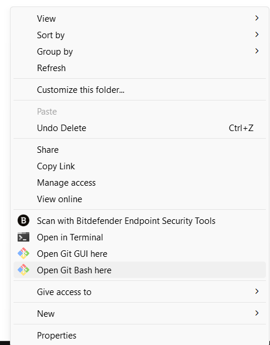
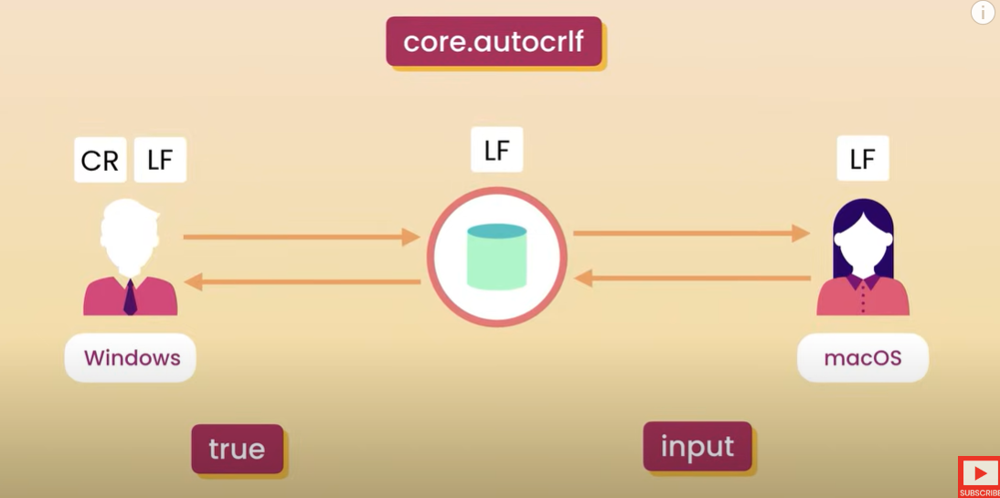

# Installation
1. Install GIT to your desktop.
2. Navigate to a folder, right click and select Open Git Bash here
   

# Settings
Let's talk about `git config` settings. 
## System Level 
Settings are applied for all users

## Global Level
Settings are applied for all the Repos of current user
```bash
git config --global user.name 'Ravisankar Pandian' #To add a user name for the git application.

git config --global user.email ravi@ravi.com #To add email for the git application 

git config --global core.editor "code --wait" #to setup the default editor as vscode. the --wait flag is to keep the window open until we close it

git config --global -e # will open the config file for us to edit
```


Let's talk about CRLF

* Windows set the EOL (end of line) as CR LF (Carriage Return Line Feed)
* Mac/Linux set the EOL as LF (only Line Feed)
So it is important to setup the EOL characters correctly when working with different OSes. 
The thumb rule is to set `true` for Windows and `input` for Mac/Linux
```bash
git config --global core.autocrlf input # for Mac/Linux
git config --global core.autocrlf true # for Windows
```
## Local Level
Settings are applied only for the current Repository


# Usage
|Command|Description|
|-|-|
`git init`            | To initialize a repository <br> Then add files/folders to the workspace to edit them
`git add <filename>`  | To add the modified/new files to the staging area <br> If you remove any file, then you need to `git add <removed_file>` in order to stage that change.


```bash
# 
  
# 


# to add all the files to the staging area
  git add . 
# This will automatically recognize the deleted file.

# to show the status of our push/commit/staged changes
  git status 

git commit # to commit the staged files for change
git commit -m 'commit message' # to commit along with a short commit message
git push # to push the committed files to the master branch?
git config --global user.name 'Ravisankar Pandian' # to add name for the github?
git config --global user.email 'ravi@ravi.com' # to add email for the github?

```
## Cheat Sheet
Click [here](resources/git.pdf) to view the cheat sheet for git commands.