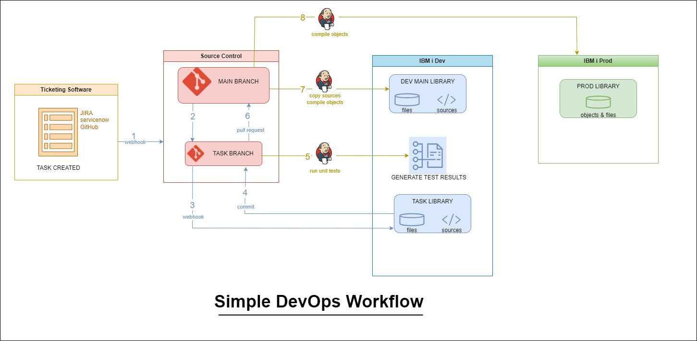

<h1 align=center> Modern DevOps Practices on IBMi</h1>

> 
 Overview
---
# The What and Why of DevOps for IBMi
Enter content here explaining the need for DevOps for IBMi
# Integral parts of DevOps
- Source Control Management
- Pipeline
- Project Management
- Network Topology & Infrastucture
  - Network Connections
  - Security Concerns
- There is no "one size fits for all"

# Major Difference between other servers and IBMi

|Others|IBMi|
|--|--|
Develop Locally and Deploy Globally | Develop & Deploy on the server itself
Database & Server are separate entities | Database & Server are one and the same
Middleware & Hypervisors are needed | Middleware & Hypervisors are integrated

# DevOps Toolset

- DevOps experts don't know about IBMi and Vice-Versa

# Source Control Management
## GIT
Let's talk about GIT - the big daddy of Version Control System. Git is a version control software, used to keep track of changes to your source code.

But don't we have Turnover, Implementor, Aldon, and others already? How Git is different?

* Git is 100% free and open source
* Git is a distributed Version Control System
* Git empowers parallel development
* It enables Historical Comparison
* Disaster Recovery or time machine (!)
* Powerful integration with CI/CD tools.
    

### Cloud based GIT tools
#### Github
  * **Most popular** code hosting software
  * Owned by Microsoft
  * Has extra features like projects, milestone, pull request
  * CICD is not available by default
  * Proprietory
#### Gitlab
  * **Open Source Alternative** to GitHub
  * Can be installed on almost any server - except IBMi :( 
  * Easier to manage projects
  * Has built in CICD pipeline
#### BitBucket
  * A native tool in Atlassian's Open Dev Ops Solution
  * Can be integrated with **Jira & Confluence**
#### GitBucket
  * An alternative to Gitlab offering **easy installation & intuitive UI**
  * **Open Source**
  * Can be **installed on IBMi** :) 
  * Issues, Pull Requests and Wiki for repositories

### A Vanilla GIT workflow for IBMers.

### General Misconceptions about GIT
  | What it does | What it doesn't|
  |--|--|
  Manages Source Code | Compiling
  Keeps a history | Testing
  Enables Branching | Project Management
  <io> | Planning
  <io> | Impact Analyisis
  <io> | Deployment 

#### Develompment Models
| Script Based | Archive Based | *Object Based* |
| -- | -- | -- |
No need to compile | Entire Project needs to be compiled | Only the changed objects need to be compiled
E.g., HTML, JS, PHP | E.g., Java | RPG, CL, C, VB
Build Process isn't compulsory | Build is compulsory | Build is required only for changed objects

#### Some concerns
- When you choose the local development model path,
  - There will be Multiple copies of the sources.
  - You need to compile from IFS
  - Source dates, Color coded comments, Modified Tag will be lost
  - Some audit information will be lost (like compiled from sourcefile etc.,)

#### Final Thoughts
- Git and GitHub are mostly different.
- Git is tool mostly for programmers.
- GitHub is a tool mostly for Project Managers and leads.
- GIT can be integrated with large number of tools.

---

# CI/CD tools
CI/CD is a practice where developers regularly merge their code changes into a central repository, followed by automated building and testing (if required). There are various tools available for IBMi.

### Merlin
* Acronym for IBM i Modernization Engine for Lifecycle Integration
* Proprietory
* **Full suite of Modern DevOps** practices

### ARCAD
* Proprietory by Rocket Systems
* Can be integrated with GIT
* Comes with an integrated IDE called **RDi**

### Jenkins
* **Free and Open Source**
* Can be integrated with GIT 
* Can setup pipeline (or) workflows for deployment
---
# Develop, Build & Deploy

## Modern IDE
* VS Code
* RDi
* ILEditor
* Arcad

## Running Test Cases
### IBMiUnit

## Dependency Management
### Source Orbit

## Deployment
### Docker
### ChRoot 
A built in RPM command which will create our own `/QOpenSys ` directory

# Workflow

1. Create Issue Task
2. Use Webhooks to create task-branch for the task
3. Use webhooks to create a task-lib for the task in IBMi Dev
4. Commit the changes to the task-branch
5. Trigger the Unit Test Cases (via CI/CD software)
6. Create a PR to merge the code to the main branch
7. Trigger the copy sources & compile objects actions in the Dev Main Library
8. Trigger the compile objects action in the Prod library in Prod System

# Points to note
- Testing is more important for DevOps
- Build the sandbox, test it, update/migrate tools, then test again. 
- Have a fallback plan during migration of PROD.

