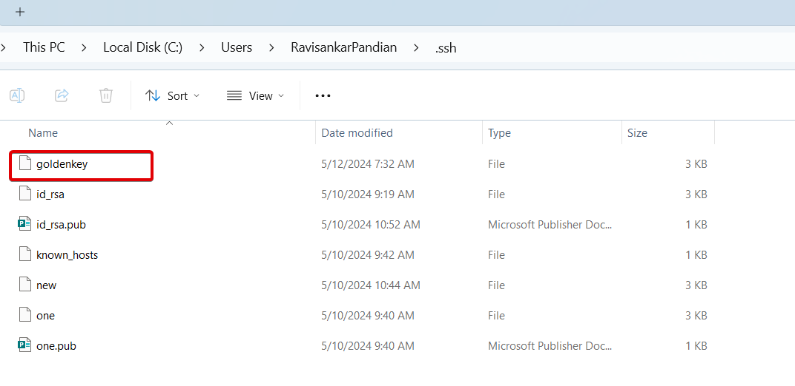

<h1 align=center> SFTP on IBMi
</h1>

>Setup IBMi to allow other systems to access it's IFS folder using SFTP

We are going to setup our laptop as SFTP client (which will request for files) and IBMi as the SFTP host (which will contain the files). So in this case, our laptop will be the one that makes a request to download files. 

In a nutshell, SFTP means the ability to do FTP without password based authentication. Without password means weak security? No, That's where the 'S' in the SFTP kicks in. Instead of password we will use the public/private keys. We will give the public key to the host (IBMi) and private key to the client (our laptop).

In order to setup IBMi as the SFTP host, where we need to,
- [Generate Keys](#generate-keys)
- [Share the private key to the client](#share-the-private-key-to-the-client)
- [Setup IBMi as Host](#setup-ibmi-as-host)
  - [Full access Method](#full-access-method)
  - [Restricted Access Method](#restricted-access-method)
- [Test the connection](#test-the-connection)


## Generate Keys
  
- Login to your IBMi with a profile that has authority to create and manage user profiles. Preferably QSECOFR. 
<br>  
- Enter command `Call QP2TERM` to enter the PASE Environment 
<br>
- Start by creating the keypairs by entering the command
  `ssh-keygen -t RSA`
  You will be asked for multiple questions for generating the keypairs. It's good to know what does these options mean.
  | Prompt | Response |
  | -- | -- |
  | Enter file in which to save the key <p style="font-size:10px;"> (we will save the file in the default .ssh directory itself. So just hit enter</p> | hit enter
  | Enter passphrase (empty for no passphrase) <p style="font-size:10px;"> (That's the power of SFTP, to use FTP without password :) So just hit enter)</p> | hit enter
  | Enter the same passphrase again <p style="font-size:10px;"> (again, hit enter) | hit enter

## Share the private key to the client

- Use VS Code, ACS, or  WinSCP to download the file `id_rsa` to the laptop and place it in `C:\Users\<username>\.ssh` folder. If there is no .ssh folder in your laptop, then please create one!
- Since I already have lot of keys in my .ssh folder, I am going to rename the file as `goldenkey`
  

## Setup IBMi as Host 
We will be creating a separate IBMi user profile with limited security access for the SFTP file transfer purpose. Whoever making an SFTP connection to the IBMi using the new user profile will have the same level of security and file system access. So we need to decide what type of access are we going to provide to the SFTP client.
<br>
| <div style="width:300px">Full Access</div>  | <div style="width:300px">Restricted Access</div> |
|-- |-- |
| The newly created user profile will just act like any other user profile in the IBMi. By default it will have access to all the files in the IFS root folder including critical config files. If you're okay with that security vulnerability, then follow the [Full Access Method](#full-access-method) | The newly created user profile will have access only to a particular folder that we allow. This method is preferred if you're going to allow some 3rd party vendor to access your IBMi's files. If you're okay with the folder restriction, then follow the [Restricted Access Method](#restricted-access-method)


  ### Full access Method 
- Login to your IBMi with a profile that has authority to create and manage user profiles (preferably QSECOFR).
<br>  

- Enter command `Call QP2TERM` to enter the PASE Environment 
<br>

- We will create separate user profile for this SFTP access. Note that the IBMi login for the user SFTPUSR1 is disabled.
  - `system "CRTUSRPRF USRPRF(SFTPUSR1) INLMNU(*SIGNOFF)"`
<br>

- Create a HOME directory on the IBM i to store the user's SSH-related files. We will be sharing this folder to the client.
  - `mkdir /home/sftpusr1`
<br>

- Create a .SSH directory within the user's home directory
  - `mkdir /home/sftpusr1/.ssh`
<br>

- Set permissions on the user's home directory.
  - `chmod 755 /home/sftpusr1`
<br>

- Set permissions on the user's .ssh directory.
  - `chmod 700 /home/sftpusr1/.ssh`
<br>

- Change ownership of the home directory to the SSH user.
  - `chown sftpusr1 /home/sftpusr1`
<br>

- Change ownership of the .SSH directory to the SSH user.
  - `chown sftpusr1 /home/sftpusr1/.ssh`
<br>

- Change the Home directory of the sftpusr1. Note that only this folder will be accessible by the client system (our laptop)
  - `system "CHGUSRPRF USRPRF(sftpusr1) HOMEDIR('/home/sftpusr1')"`
<br>

- Rename the public key `id_rsa.pub` to `authorized_keys` and place it in the home directory of SFTP1 user. 
  - `mv /home/$USER/.ssh/id_rsa.pub /home/sftpusr1/.ssh/authorized_keys`
<br>

- Change ownership of the authorized_keys file to the SSH user.
  - `chown sftpusr1 /home/sftpusr1/.ssh/authorized_keys`
<br>

- Set permissions on the authorized_keys file.
  - `chmod 600 /home/sftpusr1/.ssh/authorized_keys`
<br>

- We will create a dummy file for testing the transfer
  - `touch /home/sftpusr1/new.file`

### Restricted Access Method
- Login to your IBMi with a profile that has authority to create and manage user profiles. 
<br>  

- Enter command `Call QP2TERM` to enter the PASE Environment 
<br>

- We will create separate user profile for this SFTP access. Note that the login for the user SFTPUSR1 is disabled.
  - `system "CRTUSRPRF USRPRF(SFTPUSR1) INLMNU(*SIGNOFF)"`
<br>

- We will create a separate Root folder for the user SFTPUSR1. IBMi provides with an installation script to create a separate root folder for the specified user. Now depending upon your IBMi version, the script will be present on different location. Run the below command.
If you're running V7R2 & above,
  ```bash
  /QOpenSys/QIBM/ProdData/SC1/OpenSSH/sbin/chroot_setup_script.sh sftpusr1
  ```
  Note:
  > If you're running on V6R1, the chroot_setup_script.sh will be present in,
  >`/QOpenSys/QIBM/ProdData/SC1/OpenSSH/openssh-3.8.1p1/ `
  >If you're running V7R1, the choot_setup_script.sh will be present in,
  >`/QOpenSys/QIBM/ProdData/SC1/OpenSSH/openssh-4.7p1`
<br>

- Change the LOCALE parameter in the user profile to *NONE
  - `system "CHGUSRPRF USRPRF(SSHTEST) LOCALE(*NONE)"`
<br>

- SSH Daemon need to be started using a QSECOFR user profile
  - `/QOpenSys/usr/sbin/sshd`
  
    >Note: The SSH daemon must be started with the QSECOFR user profile to activate the chroot function. Starting the SSH daemon with a profile that has QSECOFR authority will not activate the chroot function. A user profile with a UID of (0) is required to activate the chroot function. The QSECOFR user profile on the IBM i is shipped with a UID of (0).
<br>

- Create a HOME directory on the IBM i to store the user's SSH-related files. We will be sharing this folder to the client.
  - `mkdir /QOpenSys/QIBM/UserData/SC1/OpenSSH/chroot/home/sftpusr1`
<br>

- Create a .SSH directory within the user's home directory
  - `mkdir /QOpenSys/QIBM/UserData/SC1/OpenSSH/chroot/home/sftpusr1/.ssh`
<br>

- Set permissions on the user's home directory.
  - `chmod 755 /QOpenSys/QIBM/UserData/SC1/OpenSSH/chroot/home/sftpusr1`
<br>

- Set permissions on the user's .ssh directory.
  - `chmod 700 /QOpenSys/QIBM/UserData/SC1/OpenSSH/chroot/home/sftpusr1/.ssh`
<br>

- Change ownership of the home directory to the SSH user.
  - `chown sftpusr1 /QOpenSys/QIBM/UserData/SC1/OpenSSH/chroot/home/sftpusr1`
<br>

- Change ownership of the .SSH directory to the SSH user.
  - `chown sftpusr1 /QOpenSys/QIBM/UserData/SC1/OpenSSH/chroot/home/sftpusr1/.ssh`
<br>

- Rename the public key `id_rsa.pub` to `authorized_keys` and place it in the home directory of SFTP1 user. 
  - `mv /home/$USER/.ssh/id_rsa.pub /QOpenSys/QIBM/UserData/SC1/OpenSSH/chroot/home/sftpusr1/.ssh/authorized_keys`
<br>

- Change ownership of the authorized_keys file to the SSH user.
  - `chown SFTPUSR1 /QOpenSys/QIBM/UserData/SC1/OpenSSH/chroot/home/sftpusr1/.ssh/authorized_keys`
<br>

- Set permissions on the authorized_keys file.
  - `chmod 600 /QOpenSys/QIBM/UserData/SC1/OpenSSH/chroot/home/sftpusr1/.ssh/authorized_keys`
<br>

- We will create a dummy file for testing the transfer
  - `touch /QOpenSys/QIBM/UserData/SC1/OpenSSH/chroot/home/sftpusr1/new.file`

**That's it! We've successfully setup the IBMi as SFTP host. Now the only thing left is to,**

## Test the connection
- Go to the client machine (laptop) and open the terminal.
<br>

- Enter the below command to initiate an SFTP. 
  - `sftp -i "C:\Users\RavisankarPandian\.ssh\goldenkey" sftpusr1@129.40.94.17`
  - *Make sure to replace the user name with your username*
  - *Make sure to replace your IBMi's IP address*
<br>

- We will change the current directory of my local machine to the Downloads folder
  - `lcd Downloads`
<br>

- Let's download the `new.file` that we just created on our IBMi to our laptop
  - `get new.file`
<br>

- Let's try uploading a file called `nick.jpg` from my Downloads folder to the IBMi just for fun.
  - `put nick.jgp`
<br>

- Once transfer is done, let's close the connection.
  - `bye`
<br>