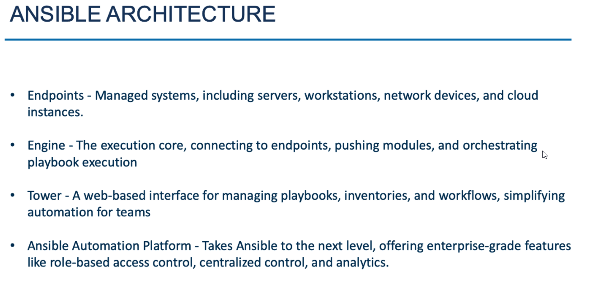

<h1 align=center> SFTP on IBMi
</h1>

>Setup IBMi to allow other systems to access it's IFS folder using SFTP

It is a three Step Process where we need to,
- [Generate Pub/Pvt Keys system](#generate-pubpvt-keys-system)
- [Setup IBMi as remote host](#setup-ibmi-as-remote-host)

## Generate Pub/Pvt Keys system
- Use the SSH-keygen utility and create an RSA key with no user name. Note that the command to create RSA key will vary from system to system. Google to find out the right method.
 
- Ask the client to transfer the public key (usually with the name `id_rsa.pub`).
 
- Using WINSCP, We will park the public key in our IBMi in `/tmp` folder for now.
  

## Setup IBMi as remote host
- Login to your IBMi with a profile that has authority to create and manage user profiles. 
   
- Enter command `Call QP2TERM` to enter the PASE Environment 
 
- We will create separate user profile for this SFTP access. Note that the login is disabled.
  `system "CRTUSRPRF USRPRF(SFTPUSR1) INLMNU(*SIGNOFF)"`
 
- Create a HOME directory on the IBM i to store the user's SSH-related files.
  `mkdir /home/sftpusr1`
 
- Create a .SSH directory within the user's home directory.
`mkdir /home/sftpusr1/.ssh`
 
- Set permissions on the user's home directory.
`chmod 755 /home/sftpusr1`
 
- Set permissions on the user's .SSH directory.
`chmod 700 /home/sftpusr1/.ssh`
 
- Change ownership of the home directory to the SSH user.
`chown sftpusr1 /home/sftpusr1`
 
- Change ownership of the .SSH directory to the SSH user.
`chown sftpusr1 /home/sftpusr1/.ssh`
 
- Change the Home directory of the sftpusr1
`system "CHGUSRPRF USRPRF(sftpusr1) HOMEDIR('/home/sftpusr1')"`
 
- Rename the public key from id_rsa.pub to authorized_keys and place it in the home directory of SSH user. (Assuming that the public key has been pasted to the /tmp folder)
  `mv /tmp/id_rsa.pub /home/sftpusr1/.ssh/authorized_keys`
 
- Change ownership of the authorized_keys file to the SSH user.
`chown sftpusr1 /home/sftpusr1/.ssh/authorized_keys`
 
- Set permissions on the authorized_keys file.
`chmod 600 /home/sftpusr1/.ssh/authorized_keys`

**That's it! We've successfully setup the IBMi as SFTP host**

